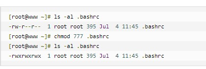
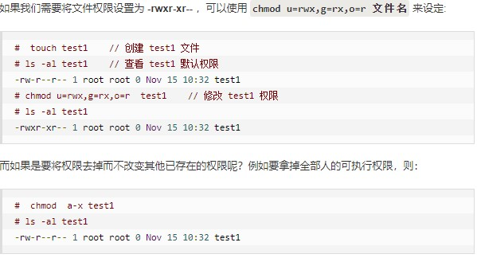

# 组管理和权限管理

## 1. Linux组基本介绍

* Linux中每个用户属于一个组，不能独立于组以外。所以在Linux中每个文件存在组的概念：
    1. 所有者
    2. 所在组
    3. 其他组
    4. 改变用户所在组

## 2. 文件/目录所有者

> 一般为文件的创建者，谁创建了该文件，就自然的称为该文件的所有者。

* 查看文件所有者：`ls -ahl`
* 修改文件所有者：`chown (用户名) (文件名)`

## 3. 文件/目录所在组

> 当某个用户创建了一个文件之后，默认之歌文件所在组就是该用户所在的组

​		修改文件所在组：`chgrp (组名) (文件名)`

## 4. 其他组

​		除文件的所有者和所在组的用户外，系统的其他用户都是文件的其他组

## 5. 文件属性

* ls -l中显示的内容如图所示

1. 在Linux中第一个字符代表这个文件的类型。
    * 当为[ d ]则是目录
    * 当为[ - ]则是文件；
    * 若是[ l ]则表示为链接文档(link file)；
    * 若是[ b ]则表示为装置文件里面的可供储存的接口设备(可随机存取装置)；
    * 若是[ c ]则表示为装置文件里面的串行端口设备，例如键盘、鼠标(一次性读取装置)。
2. 接下来的字符中，以三个为一组，且均为『rwx』 的三个参数的组合。**[ r ]代表可读(read)、[ w ]代表可写(write)、[ x ]代表可执行(execute)**。 要注意的是，这三个权限的位置不会改变，如果没有权限，就会出现减号[ - ]而已。
每个文件的属性由左边第一部分的10个字符来确定（如下图）。
    

### 5.1 rwx权限详解

* rwx作用到文件：
  * r：read，可读。读取查看。
  * w：write，可以修改。但不代表可以删除该文件。删除一个文件的前提条件是对该文件所在的目录有写权限，才能删除该文件。
  * x：execute，可执行。可以被执行。
* rwx作用到目录：
  * r：可以读取，ls查看目录内容。
  * w：可以修改，目录内创建+删除+重命名目录。
  * x：可执行，可以进入该目录。

### 5.2 修改权限

#### 5.2.1 chgrp：更改文件属组

* chgrp [-R] 属组名 文件名
  * -R：递归更改文件属组，就是在更改某个目录文件的属组时，如果加上-R的参数，那么该目录下的所有文件的属组都会更改。
  
#### 5.2.2 chown：更改文件属主，也可以同时更改文件属组

> 语法:
>
>* chown [–R] 属主名 文件名
>* chown [-R] 属主名：属组名 文件名

#### 5.2.3 chmod：更改文件9个属性

* Linux文件属性有两种设置方法，一种是数字，一种是符号。
* Linux文件的基本权限就有九个，分别是owner/group/others三种身份各有自己的read/write/execute权限。
* 我们可以使用数字来代表各个权限，各权限的分数对照表如下：
  * **r:4**
  * **w:2**
  * **x:1**
* 每种身份(owner/group/others, 中间用`,`隔开)各自的三个权限(r/w/x)分数是需要累加的，例如当权限为： [-rwxrwx---] 分数则是：
  * owner = rwx = 4+2+1 = 7
  * group = rwx = 4+2+1 = 7
  * others= --- = 0+0+0 = 0

##### 5.2.3.1 使用数字修改权限

* `chmod [-R] xyz 文件或目录`
  * xyz : 就是刚刚提到的数字类型的权限属性，为 rwx 属性数值的相加。
  * -R : 进行递归(recursive)的持续变更，亦即连同次目录下的所有文件都会变更
  * 举例来说，如果要将.bashrc这个文件所有的权限都设定启用，那么命令如下：
  

##### 5.2.3.1 使用符号修改权限

* 我们就可以使用 u(user), g(group), o(others) 来代表三种身份的权限！
* 此外， a 则代表 all，即全部的身份。读写的权限可以写成 r, w, x，也就是可以使用下表的方式来看

* 举例说明

